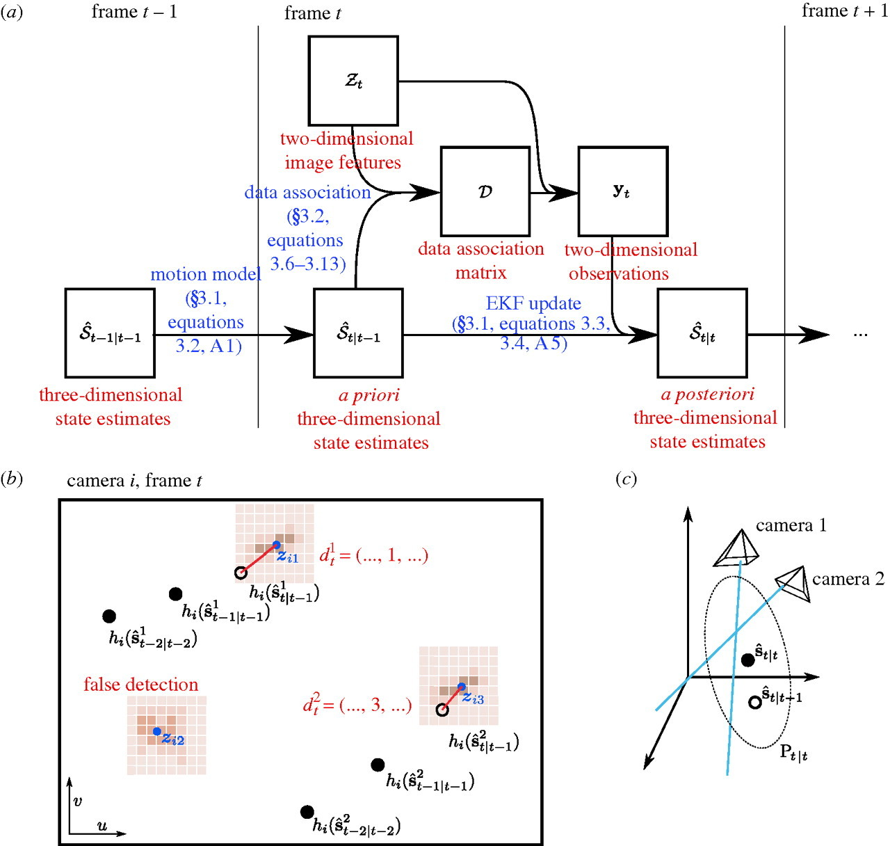

# 3D Tracking in Braid

## Principle of operation

This page describes the basic principles of how tracking in 3D is implemented by
Braid. A more detailed and more mathematical description can be found in the
paper describing Braid's predecessor, Straw et al. (2011). Please refer to this
for more details.

Straw et al. 2011: Straw AD, Branson K, Neumann TR, Dickinson MH (2011) Multicamera
Realtime 3D Tracking of Multiple Flying Animals. *Journal of The Royal Society
Interface 8*(11), 395-409.
[doi:10.1098/rsif.2010.0230](http://dx.doi.org/10.1098/rsif.2010.0230)

.

**Figure 1: Principles of 3D Tracking in Braid.** References in blue refer to
parts of [Straw et al. (2011)](http://dx.doi.org/10.1098/rsif.2010.0230). (a)
Flowchart of operations. (b) Schematic of a two-dimensional camera view showing
the raw images (brown), feature extraction (blue), state estimation (black), and
data association (red). (c) Three-dimensional reconstruction using the EKF uses
prior state estimates (open circle) and observations (blue lines) to construct a
posterior state estimate (filled circle) and covariance ellipsoid (dotted
ellipse). This figure and some caption text reproduced from Figure 2 of [Straw
et al. (2011)](http://dx.doi.org/10.1098/rsif.2010.0230) under the Creative
Commons Attribution License.

(TODO: walkthrough of figure above.)

## Tracking in water with cameras out of water

One important aspect of Braid not covered in [Straw et al.
(2011)](http://dx.doi.org/10.1098/rsif.2010.0230) is the the capability of
tracking fish (or other objects in water) from cameras placed above the water
surface.

### Refraction

When looking through the air-water interface (or any refractive boundary),
objects on the other side appear from a different direction than the direct path
to the object due to [refraction](https://en.wikipedia.org/wiki/Refraction).
Mathematically, refraction is described by [Fermat's principle of least
time](https://en.wikipedia.org/wiki/Fermat%27s_principle), and this forms the
basis of Braid's tracking in water.

### Principle of operation for tracking in water

When considering the principle of operation of 3D tracking described above, the
primary addition to Braid required for tracking in water is the ability to model
the rays coming from the animal to the camera not as straight lines but rather
having a bend due to refraction. To implement this, the observation model of the
extended Kalman filter is extended to incorporate the air-water boundary so that
it consists of both a 3D camera model and air-water surface model. Thus, during
the update step of the Kalman filter, this non-linear model is linearized about
the expected (*a priori*) position of the tracked object.

Currently, Braid has a simplification that the model of the air-water boundary
is always fixed at z=0. Thus, anything with z<0 is under water and anything with
z>0 is above water. This implies that the coordinate frame for tracking with an
air-water boundary must have this boundary at z=0 for correct tracking.

### How to enable tracking in water.

Practically speaking, tracking using the model of an air-water boundary is
enabled by placing the string `<water>1.333</water>` the XML camera calibration
file. This will automatically utilize the refractive boundary model described
above with a value for the refractive index of 1.333 for the medium at z<0. As
1.333 is the refractive index of water, it is a model of refraction in water.

## Tracking multiple objects in 3D

It is possible to use Braid to track two or more objects in 3D. Typically this
requires the per-camera, 2D object detection to be set to also detect multiple
objects. Thus, the parameter `max_num_points` in the Object Detection
configuration of Strand Camera should be set to at least the number of objects
that should be tracked.

To maintain object identity over time, such that a single trajectory is recorded
for a single animal, Braid uses a simple data association algorithm which
assumes independent movement of the tracked objects. This is sufficient in many
cases for tracking animals even when they interact strongly with each other, but
it is typically be necessary to tune relevant tracking and data association
parameters to get the best performance possible.
